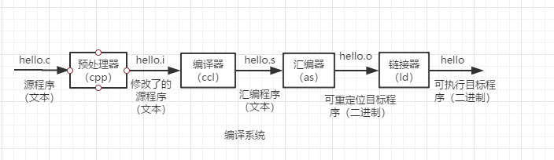
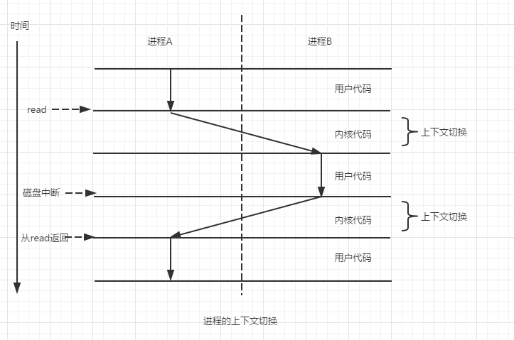
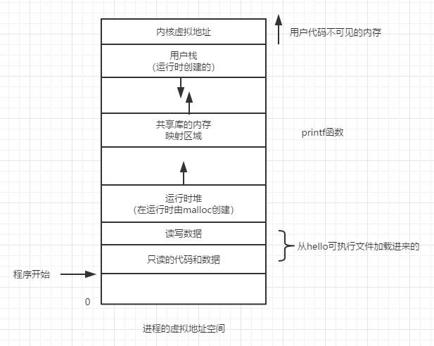

# 深入理解计算机系统
## 第一章：计算机系统漫游
计算机系统是由硬件和系统软件组成的，它们共同工作来运行应用程序。
#### 1、信息就是位+上下文
    1、位：
         0和1组成的位，又称为比特（bit）序列。源程序就是0和1组成的位序列。8个位被组织成一组，成为字节。每个字节表示程序中的某些文本字符。
         大部分的现代计算机系统都使用ASCII标准来表示文本字符，这种方式实际上就是用唯一的单字节大小的整数值来表示每个字符。
         只由ASCII字符构成的文件称为文本文件，所有其他文件都被称为二进制文件。
         系统中所有的信息---包括磁盘文件、内存中的程序、内存中存放的用户数据以及网络上传送的数据，都是由一串比特表示的。区分不同数据对象的唯一方法是我们读到这些数据对象时的上下文。
    2、上下文：用于区分数据不同对象的记录。
       在不同的上下文中，一个同样的字节序列可能表示一个整数、浮点数、字符串或者机器指令。
#### 2、程序编译
&emsp;&emsp;程序编译是将源程序转化为一系列的低级机器语言指令。指令集组成的文件也就是可执行目标文件。过程如下图

#### 3、编译系统的好处
    1、优化程序性能
    2、理解链接时出现的错误
    3、避免安全漏洞
#### 4、系统的运行
&emsp;&emsp;1、计算机硬件的组成
    
     1、总线---贯穿整个系统的一组电子管道，称作总线。
     2、I/O设备---I/O设备是系统与外部世界的联系通道。
     3、主存---主存是一个临时存储设备，在处理器执行程序时，用来存放程序和程序处理的数据。
     4、处理器---CPU，简称处理器，是解释（或执行）存储在主存中指令的引擎。处理器的核心是一个大小为一个字的存储设备（寄存器），称为程序计数器（PC）。
&emsp;&emsp;2、运行执行程序
#### 5、高速缓存
&emsp;&emsp;随着半导体的发展，处理器与主存之间的差距越来越大，针对这种差异，系统设计者采用了更小更快的存储设备，称为高速缓存存储器（cache memory）,作为暂时的集结区域，存放处理器近期可能会需要的信息。
#### 6、存储分层次结构
    每个计算机系统中的存储设备都被组织成了一个存储器层次结构。设备的访问速度越慢、容量越大，并且每字节的造价也更便宜。
#### 7、操作系统管理硬件
     操作系统有两个基本功能：防止硬件被失控的程序滥用；向应用程序提供简单一致的机制来控制复杂而又通常大不相同的低级硬件设备。
     1、进程--操作系统对一个正在运行的的程序的一种抽象。
             操作系统保持跟踪进程运行所需的所有状态信息，这种状态，也就是上下文，包括许多信息，比如PC和寄存器文件的当前值，以及主存的内容。
             从一个进程到另一个进程的转换是由操作系统内核（kernel）管理的。
             
      
     2、线程--操作系统调度的最小单元。
        一个进程实际上可以由多个称为线程的执行单元组成，每个线程都运行在进程的上下文中，并共享同样地代码和全局数据。
     3、虚拟内存--每个进程都在独占地使用主存。
     每个进程看到的内存都是一致的，称为虚拟地址空间。
     
     
     程序代码和数据--
     堆--代码和数据区后紧随着的是运行时堆。
     共享库--存放共享代码和数据的区域。
     栈--位于用户虚拟地址空间顶部的是用户栈，编译器用它来实现函数调用。
     内核虚拟内存--地址空间顶部的区域是为内核保留的
     4、文件--文件就是字节序列。
#### 8、系统之间的网络通信 
&emsp;&emsp;随着Internet这样的全球网络的出现，从一台主机复制信息到另外一台主机已经成为计算机系统最重要的用途之一。比如使用telnet的服务端和客户端进行交互。
#### 9、一些重要概念和主题
     1、Amdahl定律---当我们对系统某个部分加速时，其对系统整体性能的影响取决于该部分的重要性和加速程度。
     2、并发和并行
        并发（concurrency）--指一个同时具有多个活动的系统
        并行（parallelism）--指的是用并发来使一个系统运行得更快。
        1、线程级并发
           使用线程，能够在一个进程中执行多个控制流。
        2、指令级并行
           在较低的抽象层次上，现代处理器可以同时执行多条指令的属性成为指令级并行。
        3、单指令、多数据并行
           允许一条指令产生多个可以并行执行的操作，这种方式成为单指令、多数据、即SIMD并行。
     3、一些重要抽象
        抽象的使用计算机科学中最为重要的概念之一。
        指令集架构提供了对实际处理器硬件的抽象。
        虚拟内存是对程序存储器的抽象，而进程是对一个正在运行得程序的抽象。
        虚拟机：他提供对整个计算机的抽象，包括操作系统、处理器和程序。